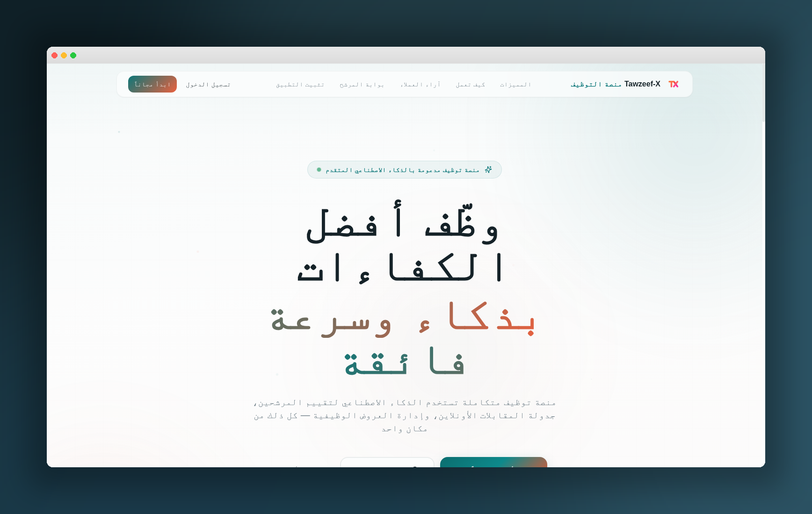

<div align="center">

# 🚀 Tawzeef-X | توظيف-إكس

### Smart Recruitment Platform | منصة التوظيف الذكية

[](https://lovable.dev)
[](https://www.typescriptlang.org/)
[](https://react.dev/)
[](https://tailwindcss.com/)

<br />



<br />

**Tawzeef-X** is an AI-powered recruitment management platform designed to streamline the entire hiring process — from job posting to offer acceptance.

**توظيف-إكس** هي منصة توظيف ذكية مدعومة بالذكاء الاصطناعي، مصممة لتبسيط عملية التوظيف بالكامل — من نشر الوظائف حتى قبول العروض.

</div>

---

## 🇬🇧 English

### ✨ Key Features

| Feature | Description |
|---------|-------------|
| 🤖 **AI-Powered Screening** | Automatic resume parsing, candidate ranking, and smart evaluation |
| 📋 **Job Management** | Create, publish, and manage job listings with AI-generated descriptions |
| 👥 **Candidate Pipeline** | Drag-and-drop Kanban board to track candidates through hiring stages |
| 📅 **Interview Scheduling** | Calendar integration with automated reminders and video interview support |
| 📊 **Analytics & Reports** | Comprehensive dashboards with hiring metrics and performance insights |
| 💼 **Offer Management** | Digital offer letters with e-signature and candidate portal |
| 🔔 **Real-time Notifications** | Instant updates on application status changes and interview schedules |
| 🌐 **Bilingual Support** | Full Arabic (RTL) and English interface |
| 🎓 **Interactive Tutorial** | Built-in guide with video tutorials for all platform features |
| 🔒 **Role-Based Access** | Admin, Recruiter, Reviewer, and Job Seeker roles with granular permissions |
| 🏢 **Career Page** | Public-facing careers page with QR code sharing |
| 🧠 **AI Assistant** | Chat-based AI helper for recruitment queries and recommendations |

### 🛠️ Tech Stack

- **Frontend:** React 18, TypeScript, Tailwind CSS, Framer Motion
- **UI Components:** shadcn/ui, Radix UI
- **State Management:** TanStack React Query
- **Backend:** Lovable Cloud (Supabase)
- **AI Integration:** Lovable AI (Multi-model support)
- **Video:** Remotion (Tutorial video generation)
- **Charts:** Recharts
- **Forms:** React Hook Form + Zod validation

### 🚀 Getting Started

```bash
# Clone the repository
git clone <YOUR_GIT_URL>

# Navigate to project directory
cd tawzeef-x

# Install dependencies
npm install

# Start development server
npm run dev
```

The app will be available at `http://localhost:8080`

### 📁 Project Structure

```
src/
├── components/        # Reusable UI components
│   ├── ui/           # shadcn/ui base components
│   ├── tutorial/     # Tutorial & guide components
│   ├── reports/      # Analytics & reporting
│   └── resume/       # Resume builder templates
├── contexts/         # React contexts (Auth, i18n, Theme)
├── hooks/            # Custom React hooks
├── i18n/             # Translations (Arabic & English)
├── integrations/     # Backend integrations
├── lib/              # Utility functions
├── pages/            # Route pages
└── test/             # Test files

supabase/
├── functions/        # Edge functions (AI, email, webhooks)
└── config.toml       # Backend configuration

remotion/             # Video generation compositions
```

---

## 🇸🇦 العربية

### ✨ المميزات الرئيسية

| الميزة | الوصف |
|--------|-------|
| 🤖 **فرز ذكي بالذكاء الاصطناعي** | تحليل السير الذاتية تلقائياً وترتيب المرشحين وتقييمهم |
| 📋 **إدارة الوظائف** | إنشاء ونشر وإدارة إعلانات الوظائف مع وصف مُولّد بالذكاء الاصطناعي |
| 👥 **مسار المرشحين** | لوحة كانبان بالسحب والإفلات لتتبع المرشحين عبر مراحل التوظيف |
| 📅 **جدولة المقابلات** | تكامل مع التقويم مع تذكيرات تلقائية ودعم المقابلات المرئية |
| 📊 **تحليلات وتقارير** | لوحات معلومات شاملة مع مقاييس التوظيف ورؤى الأداء |
| 💼 **إدارة العروض** | خطابات عروض رقمية مع توقيع إلكتروني وبوابة المرشح |
| 🔔 **إشعارات فورية** | تحديثات لحظية عن تغييرات حالة الطلبات وجداول المقابلات |
| 🌐 **دعم ثنائي اللغة** | واجهة كاملة بالعربية (RTL) والإنجليزية |
| 🎓 **دليل تفاعلي** | دليل مدمج مع فيديوهات تعليمية لجميع ميزات المنصة |
| 🔒 **صلاحيات حسب الأدوار** | أدوار المسؤول والمُوظِّف والمُراجع والباحث عن عمل بصلاحيات دقيقة |
| 🏢 **صفحة الوظائف** | صفحة وظائف عامة مع مشاركة برمز QR |
| 🧠 **مساعد ذكي** | مساعد ذكاء اصطناعي للاستفسارات والتوصيات |

### 🛠️ التقنيات المستخدمة

- **الواجهة الأمامية:** React 18، TypeScript، Tailwind CSS، Framer Motion
- **مكونات الواجهة:** shadcn/ui، Radix UI
- **إدارة الحالة:** TanStack React Query
- **الخلفية:** Lovable Cloud
- **الذكاء الاصطناعي:** Lovable AI (دعم متعدد النماذج)
- **الرسوم البيانية:** Recharts

### 🚀 البدء السريع

```bash
# استنساخ المستودع
git clone <YOUR_GIT_URL>

# الانتقال لمجلد المشروع
cd tawzeef-x

# تثبيت التبعيات
npm install

# تشغيل خادم التطوير
npm run dev
```

---

<div align="center">

### 📄 License | الرخصة

This project is private and proprietary.

هذا المشروع خاص ومحمي الحقوق.

---

**Built with ❤️ using [Lovable](https://lovable.dev)**

</div>
