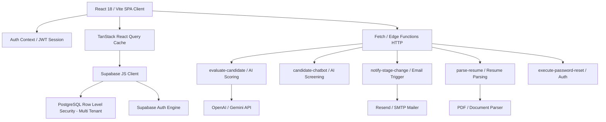

# توثيق وهيكلية النظام (Project Architecture)

**اسم المشروع**: Tawzeef X / HireBuddy  
**نوع الهيكلية الحالية**: Modular Single Page Application (SPA) with Cloud BaaS & Serverless Functions  

---

## 1. وصف الـ Architecture الحالية
يعتمد المشروع على نموذج **Single Page Application (SPA)** حديث مبني فوق **React 18 + Vite**، ويتصل بخلفية **Supabase Cloud BaaS** لإدارة البيانات والـ Authentication والـ Row Level Security (RLS)، إلى جانب 10+ دالات سحابية (Edge Functions) في **Deno/TypeScript** لمعالجة الأتمتة المعقدة والذكاء الاصطناعي.

### التكدس التقني (Tech Stack):
- **Frontend Framework**: React 18, Vite 5, TypeScript 5.8
- **UI & Styling**: Tailwind CSS, Shadcn UI / Radix UI, Framer Motion, Lucide Icons
- **State Management & Caching**: TanStack React Query v5, React Context (`AuthContext`, `I18nContext`), LocalStorage
- **Backend & Database**: Supabase PostgreSQL 15, Supabase Auth (JWT), Supabase Storage, Supabase Realtime
- **Serverless Logic**: Deno / Edge Functions (`/supabase/functions/*`)
- **Testing**: Vitest, React Testing Library, TestSprite CLI

---

## 2. المخطط النصي للهيكلية وتدفق البيانات (Mermaid Diagram)

---

## 3. الوحدات الرئيسية وتدفق البيانات (Data Flow)

1. **Authentication & Multi-Tenancy**:
   - تسجيل الدخول ينشئ جلسة JWT تحتوي على `user_id` و `company_id`.
   - يتم تطبيق RLS في PostgreSQL لتقييد الوصول لقواعد البيانات بحيث لا يستطيع المستخدم رؤية سوى وظائف ومرشحي شركته فقط.

2. **Hiring Pipeline Workflow**:
   - تُجلب المراحل النشطة (`pipeline_stages`) والبطاقات (`candidates`) عبر `useQuery`.
   - سحب البطاقات يستخدم `@dnd-kit/core` مع فحص فوري لشروط الانتقال (`checkTransitionRules`).
   - عند الإفلات والتأكيد، يُنفذ `supabase.from("candidates").update(...)` ويُسجل الحدث في `stage_history` و `audit_log`.
   - في حال ضبط أتمتة على المرحلة، تُستدعى Edge Function مناسبة تلقائياً (مثل إرسال البريد أو التقييم الآلي).

3. **Assessments & Anti-Cheat Proctoring**:
   - المرشح يدخل الاختبار عبر رابط فريد بالرمز (`/assessment/:token`).
   - يتم تتبع الأحداث الحية: تبديل التبويبات (Tab Switches)، نسخ النصوص، والخروج من الشاشة الفولاد.
   - تُحفظ النتيجة في `assessment_responses` مع تقييم النزاهة (`integrity_score`).

---

## 4. تقييم الهيكلية: نقاط القوة وتحديد المشكلات

### نقاط القوة:
- **Separation of Concerns**: فصل واضح بين واجهة المستخدم والمكونات والتخصيصات عبر `hooks/` و `components/`.
- **Reusability**: استخدام مكونات Shadcn UI و Radix UI يوفر إتاحة وقابلية عالية لإعادة الاستخدام.
- **Robust Multi-Tenancy**: عزل حقيقي للشركات عبر `company_id` وسياسات RLS المحمية.

### المشكلات الهيكلية الحالية:
- **Monolithic Page Components**: بعض صفحات التطبيق مثل `Pipeline.tsx` و `AIAssistant.tsx` تضم مئات الأسطر وتخلط بين واجهة العرض (UI Rendering) والـ Business Logic والتواصل مع API مباشرة بدلاً من استخدام Custom Hooks مخصصة.
- **Direct Fetch to Edge Functions**: استدعاء `fetch(SUPABASE_URL/functions/v1/...)` مكرر يدويًا داخل المكونات بدلاً من توحيده في خدمة مركزية `edgeApi.ts`.
